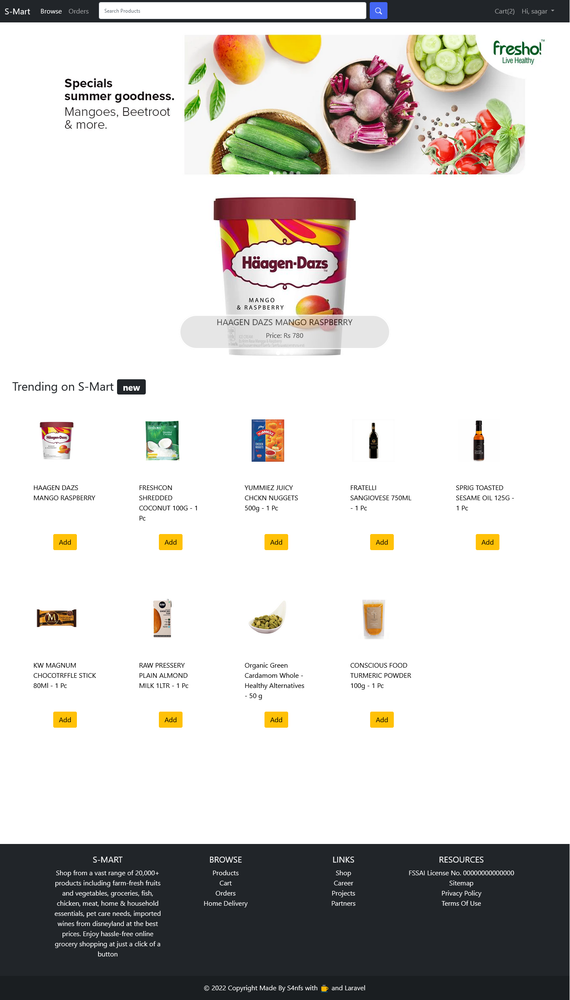

## About This Project
This is a Laravel Ecommerce Project based on the Laravel 8. This project is a complete Laravel Ecommerce Project with the following features:
1. Login & Register
2. Product Listing
3. Product Details
4. Cart
5. Checkout
6. Remove Item from Cart
7. Search Products in search bar

Features to be implemented: Order Listing, Payment Gateway, Mailing, Product rating, User comments, etc.
Note : You can import my dummy data without any migrations, just import the ecommerce.sql file in your database.

 

<h1 align="center">Login Page</h1>

 

<h1 align="center">Home Page</h1>

  

<h1 align="center">Add Cart Page</h1>

  

<h1 align="center">Checkout Page</h1>

  
<h1 align="center">Payment Page</h1>

  

